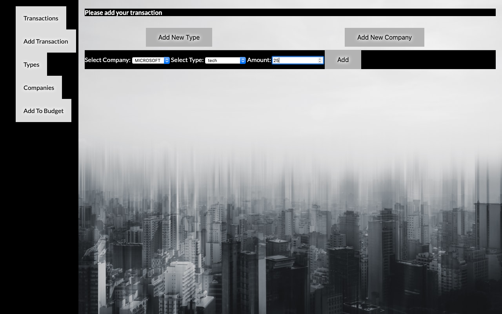

# Spending Tracker Ruby Project

Spending tracker full stack application created using Ruby and. The app allows the user to save transactions, add new categories and companies. Tracker also allows to track total spending against user’s budget. Application allows to filter user’s transactions by category and companies.
Application was build using MVC framework, using Sinatra
for the front-end and PostgreSql for the back-end database.
#

### Below we can see all the transactions that were recorded when we navigate to Transacitons tab on the left.

### We can also add Companies or Types of transactions.

### Then we can use this company to add transaciton.

### Application will allow us to sort our transactions by date, company or type of transaction(Below we can see a our transactions sorted by tech type)
.
